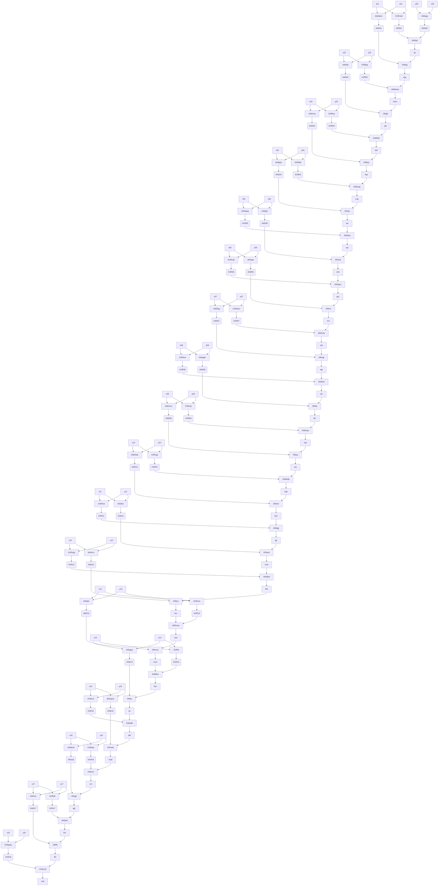
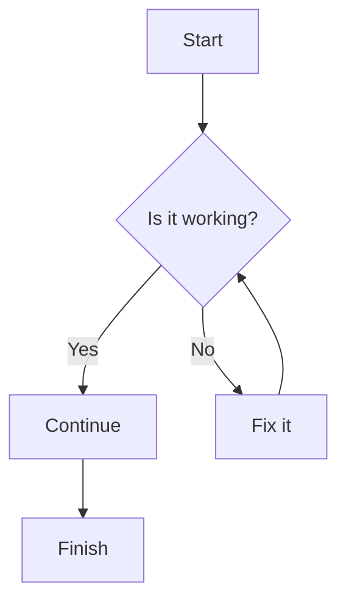

// filepath: /c:/Users/sylvain.lecourtois/source/repos/AdventOfCode2024/Day24_2/visu.md

```mermaid
    graph TD
x18 --> XORgdw
y18 --> XORgdw
XORgdw --> gdw
x17 --> XORdtt
y17 --> XORdtt
XORdtt --> dtt
x16 --> XORbqc
y16 --> XORbqc
XORbqc --> bqc
x15 --> ANDspm
y15 --> ANDspm
ANDspm --> spm
x15 --> XORsvf
y15 --> XORsvf
XORsvf --> svf
x12 --> ANDrvn
y12 --> ANDrvn
ANDrvn --> rvn
x11 --> ANDfvv
y11 --> ANDfvv
ANDfvv --> fvv
x11 --> XORhrd
y11 --> XORhrd
XORhrd --> hrd
x10 --> XORrqp
y10 --> XORrqp
XORrqp --> rqp
x09 --> XORcpt
y09 --> XORcpt
XORcpt --> cpt
x08 --> ANDgbn
y08 --> ANDgbn
ANDgbn --> gbn
x07 --> XORckm
y07 --> XORckm
XORckm --> ckm
x06 --> ANDgnt
y06 --> ANDgnt
ANDgnt --> gnt
x06 --> XORrqd
y06 --> XORrqd
XORrqd --> rqd
x05 --> ANDgrf
y05 --> ANDgrf
ANDgrf --> grf
x05 --> XORwpq
y05 --> XORwpq
XORwpq --> wpq
x04 --> XORfdk
y04 --> XORfdk
XORfdk --> fdk
x03 --> XORhsj
y03 --> XORhsj
XORhsj --> hsj
x02 --> XORjpq
y02 --> XORjpq
XORjpq --> jpq
x00 --> ANDppj
y00 --> ANDppj
ANDppj --> ppj
x01 --> XORmtd
y01 --> XORmtd
XORmtd --> mtd
ppj(AND00) --> ANDjrp
mtd(XOR01) --> ANDjrp
ANDjrp --> jrp
x01 --> ANDdsm
y01 --> ANDdsm
ANDdsm --> dsm
jrp --> ORwjg
dsm(AND01) --> ORwjg
ORwjg --> wjg
jpq(XOR02) --> ANDkwm
wjg --> ANDkwm
ANDkwm --> kwm
x02 --> ANDrjb
y02 --> ANDrjb
ANDrjb --> rjb
kwm --> ORgfc
rjb(AND02) --> ORgfc
ORgfc --> gfc
hsj(XOR03) --> ANDbtd
gfc --> ANDbtd
ANDbtd --> btd
x03 --> ANDvmj
y03 --> ANDvmj
ANDvmj --> vmj
btd --> ORbqv
vmj(AND03) --> ORbqv
ORbqv --> bqv
fdk(XOR04) --> ANDrwg
bqv --> ANDrwg
ANDrwg --> rwg
x04 --> ANDjqn
y04 --> ANDjqn
ANDjqn --> jqn
rwg --> ORrpv
jqn(AND04) --> ORrpv
ORrpv --> rpv
wpq(XOR05) --> ANDwjv
rpv --> ANDwjv
ANDwjv --> wjv
grf(AND05) --> ORchd
wjv --> ORchd
ORchd --> chd
rqd(XOR06) --> ANDgsc
chd --> ANDgsc
ANDgsc --> gsc
gnt(AND06) --> ORhrn
gsc --> ORhrn
ORhrn --> hrn
ckm(XOR07) --> ANDvds
hrn --> ANDvds
ANDvds --> vds
x07 --> ANDhgj
y07 --> ANDhgj
ANDhgj --> hgj
vds --> ORwjp
hgj(AND07) --> ORwjp
ORwjp --> wjp
x08 --> XORkvn
y08 --> XORkvn
XORkvn --> kvn
wjp --> ANDtvb
kvn(XOR08) --> ANDtvb
ANDtvb --> tvb
gbn(AND08) --> ORbfv
tvb --> ORbfv
ORbfv --> bfv
cpt(XOR09) --> ANDnqs
bfv --> ANDnqs
ANDnqs --> nqs
x09 --> ANDvsm
y09 --> ANDvsm
ANDvsm --> vsm
nqs --> ORpsj
vsm(AND09) --> ORpsj
ORpsj --> psj
rqp(XOR10) --> ANDbqk
psj --> ANDbqk
ANDbqk --> bqk
x10 --> ANDhwk
y10 --> ANDhwk
ANDhwk --> hwk
bqk --> ORdnn
hwk(AND10) --> ORdnn
ORdnn --> dnn
hrd(XOR11) --> ANDjjg
dnn --> ANDjjg
ANDjjg --> jjg
fvv(AND11) --> ORhwd
jjg --> ORhwd
ORhwd --> hwd
x12 --> XORskg
y12 --> XORskg
XORskg --> skg
hwd --> ANDfbd
skg(XOR12) --> ANDfbd
ANDfbd --> fbd
rvn(AND12) --> ORbcc
fbd --> ORbcc
ORbcc --> bcc
x13 --> XORrnw
y13 --> XORrnw
XORrnw --> rnw
bcc --> ANDrww
rnw(XOR13) --> ANDrww
ANDrww --> rww
x13 --> ANDjrk
y13 --> ANDjrk
ANDjrk --> jrk
rww --> ORmcw
jrk(AND13) --> ORmcw
ORmcw --> mcw
x14 --> XORftr
y14 --> XORftr
XORftr --> ftr
mcw --> ANDfkw
ftr(XOR14) --> ANDfkw
ANDfkw --> fkw
x14 --> ANDgpc
y14 --> ANDgpc
ANDgpc --> gpc
fkw --> ORrjn
gpc(AND14) --> ORrjn
ORrjn --> rjn
svf(XOR15) --> ANDpfb
rjn --> ANDpfb
ANDpfb --> pfb
spm(AND15) --> ORmdd
pfb --> ORmdd
ORmdd --> mdd
bqc(XOR16) --> ANDctn
mdd --> ANDctn
ANDctn --> ctn
x16 --> ANDpvd
y16 --> ANDpvd
ANDpvd --> pvd
ctn --> ORqgt
pvd(AND16) --> ORqgt
ORqgt --> qgt
dtt(XOR17) --> ANDbct
qgt --> ANDbct
ANDbct --> bct
x17 --> ANDvvt
y17 --> ANDvvt
ANDvvt --> vvt
bct --> ORffh
vvt(AND17) --> ORffh
ORffh --> ffh
gdw(XOR18) --> XORz18
ffh --> XORz18
XORz18 --> z18  
```

```mermaid
    graph TD
    A[Start] --> B{Is it working?}
    B -- Yes --> C[Continue]
    B -- No --> D[Fix it]
    D --> B
    C --> E[Finish]
```
